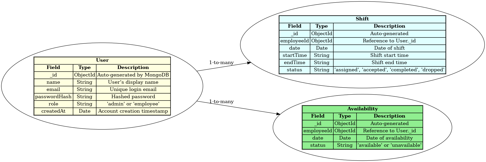

# shift-scheduler-app
A full-stack web application for managing employee work shifts with admin and employee roles.

## 📐 Planning & Design Phase

This project was planned with professional software engineering practices, including the following deliverables:

### ✅ App Features Plan

- Admin login and dashboard
- Employee login and dashboard
- Add, edit, delete shifts
- View assigned shifts
- Accept, drop, mark completed
- Employee availability calendar

### ✅ Data Model Design

Entity Relationship Diagram (ERD) showing database schema:

### ✅ Wireframes

The following wireframes visualize the UI structure of each page:

- [Landing Page Wireframe](docs/wireframe_landing_page.png)
- [Login Page Wireframe](docs/wireframe_login_page.png)
- [Admin Dashboard Wireframe](docs/wireframe_admin_dashboard.png)
- [Add/Edit Shift Wireframe](docs/wireframe_add_edit_shift.png)
- [Employee Dashboard Wireframe](docs/wireframe_employee_dashboard.png)
- [Availability Calendar Wireframe](docs/wireframe_availability_calendar.png)
